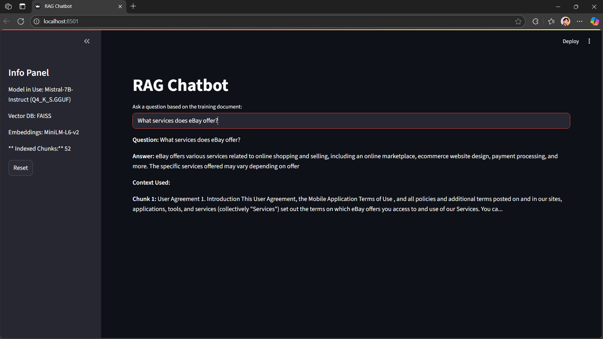
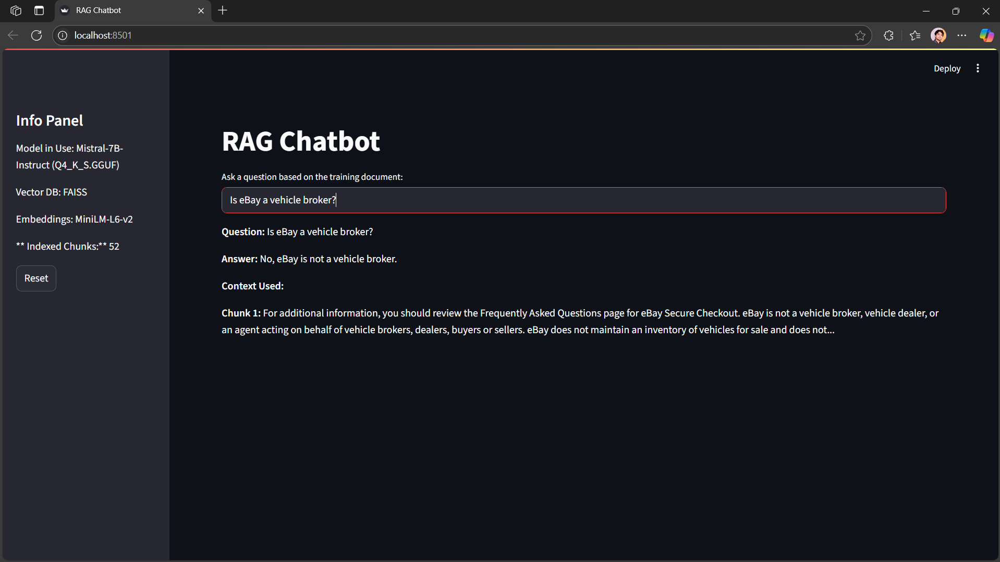
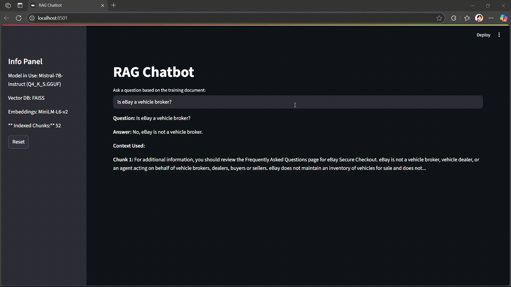

# 🤖 RAG Chatbot — Amlgo Labs Assignment

A document-grounded chatbot powered by Retrieval-Augmented Generation (RAG) using FAISS, MiniLM embeddings, and a quantized Mistral-7B-Instruct model in GGUF format. This chatbot runs fully **offline**, with **local document processing**, **contextual retrieval**, and **natural language generation** using a **Streamlit** interface.

---

## 🔧 Project Architecture & Flow

```
📄 Document → 📚 Chunking → 🔢 Embeddings → 📁 FAISS Index
                                  ↓
                             User Query
                                  ↓
                        🧠 Semantic Retrieval
                                  ↓
                     🗣️ Prompt Construction (LLM)
                                  ↓
                     🤖 Local Model Response (GGUF)
                                  ↓
                        📑 Displayed with Context
```

- `retriever.py`: Encodes and indexes document chunks using FAISS.
- `generator.py`: Loads local LLM (Mistral) using `ctransformers`, builds prompts.
- `pipeline.py`: Combines retriever and generator into a unified pipeline.
- `app.py`: Provides the frontend UI using Streamlit.

---

## 📁 Folder Structure

```
rag-chatbot/
├── app.py
├── README.md
├── .gitignore
├── requirements.txt
├── data/
│   └── training_doc.txt
├── chunks/
│   ├── chunks_0.txt
│   ├── chunks_...txt
│   └── chunks_51.txt
├── vectordb/
│   ├── index.faiss
│   └── chunks.pkl
├── model/
│   └── mistral-7b-instruct-v0.1.Q4_K_S.gguf
├── notebooks/
│   ├── extract_text.py
│   ├── chunk_text.py
│   └── embed_chunks.py
└── src/
    ├── retriever.py
    ├── generator.py
    └── pipeline.py
```

---
## 🧩 Preprocessing Steps[NOT NEEDED ALREADY PROVIDED]

### 1. Convert PDF to Text

```bash
python notebooks/extract_text.py
```

### 2. Chunk the Text File

```bash
python notebooks/chunk_text.py
```

### 3. Generate Embeddings and FAISS Index

```bash
python notebooks/embed_chunks.py
```

---


## 🧠 Model & Embedding Choices

| Component            | Choice                                | Why?                                      |
|---------------------|----------------------------------------|-------------------------------------------|
| Embeddings Model    | `all-MiniLM-L6-v2`                     | Lightweight and accurate for semantic search |
| Vector Store        | `FAISS`                                | Fast and efficient for local similarity search |
| LLM                 | `Mistral-7B-Instruct.Q4_K_S.gguf`      | Balanced between performance and speed |
| Backend Loader      | `ctransformers`                        | Runs quantized `.gguf` LLMs on CPU/GPU     |

---

## ▶️ How to Run Locally (With Streamlit)

### 1. Clone and Set Up

```bash
git clone https://github.com/bilalahmad0210/rag-chatbot.git
cd rag-chatbot
python -m venv env
env\Scripts\activate   # or source env/bin/activate on Linux/macOS
pip install -r requirements.txt
```

### 2. Download Model

From HuggingFace: https://huggingface.co/TheBloke/Mistral-7B-Instruct-v0.1-GGUF  
Place `.gguf` file in: `model/mistral-7b-instruct.Q4_K_S.gguf`

### 3. Launch Chatbot

```bash
streamlit run app.py
```

The app runs on: **http://localhost:8501**

---

## 💬 Sample Queries

| User Question                                      | Expected Answer Snippet                                  |
|---------------------------------------------------|-----------------------------------------------------------|
| What services does eBay offer?                    | Tools for pricing, listing, shipping, and sourcing.       |
| Is eBay a vehicle broker?                         | eBay is not a vehicle broker, dealer, or agent.           |
| Can users follow AI-generated suggestions?        | Yes, but it’s optional and informational.                 |
| What is the role of the arbitrator in disputes?   | Resolves disputes and interprets arbitration clauses.     |

---

## 🖼️ Screenshots

### 🔍 Example 






---

## 📺 Demo Video

🎥 [Watch full demo on YouTube](https://www.youtube.com/watch?v=xDGLub5JPFE)

---

## Project Report

📃 [Report](assets/Project_report.pdf)

---

## 🙋‍♂️ Author

Built by Bilal Ahmad or the Amlgo Labs AI Engineering Challenge.
